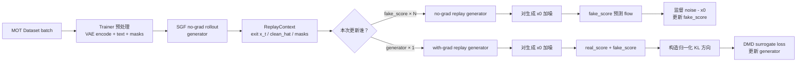

这个 trainer 负责“把 SGF-DMD 算法接入真实训练系统”，但它本身不实现 DMD 数学公式。它主要做四件事：

1. 建立并包装三个模型；
2. 管理两个 optimizer 的交替更新；
3. 把数据集 batch 转成 V/A latent 训练输入；
4. 保存/恢复可继续训练的完整 checkpoint。

算法本体在 [dmd.py](/Users/zhengshuhang/Desktop/code/mywam_sgfpipe/myWAM/distillation/model/dmd.py:463)，训练器在 [self_gradient_forcing_dmd.py](/Users/zhengshuhang/Desktop/code/mywam_sgfpipe/myWAM/distillation/trainer/self_gradient_forcing_dmd.py:25)，通用训练循环在 [base.py](/Users/zhengshuhang/Desktop/code/mywam_sgfpipe/myWAM/distillation/trainer/base.py:68)。

训练中的三套模型是：

| 角色 | 架构 | 是否训练 | 作用 |
|---|---|---:|---|
| `generator` | 自回归 `autoregressive_va_mot_v1` | 是 | SGF rollout、replay、最终导出 |
| `real_score` | 双向 `va_mot_v1` | 否 | 近似真实数据分布的固定 teacher |
| `fake_score` | 双向 `va_mot_v1` | 是 | 学习 generator 当前生成分布 |



## 【`SelfGradientForcingDMDTrainer`：建立模型、包装分布式训练、配置两个 optimizer】

```python
class SelfGradientForcingDMDTrainer(DistillationTrainerBase):
    method = SELF_GRADIENT_FORCING_DMD

    def __init__(self, config):
        # Base 负责 dataloader、模型构建、FSDP/AC 包装。
        super().__init__(config)

        # generator 和 fake_score 分别有 optimizer。
        self._build_optimizer(config)

        # 只有 generator optimizer 配套 LR scheduler。
        self.lr_scheduler = self._build_lr_scheduler(
            config,
            self.optimizer,
        )

        # 若是精确续训，恢复模型、两个 optimizer、RNG、步数等。
        if self._resume_from is not None:
            self.load_checkpoint(self._resume_from)

    def _build_method_model(self, config):
        # generator 必须从 AR checkpoint 初始化。
        student_init = config.distill.student_init

        # real_score 必须从双向 score checkpoint 初始化。
        real_score_checkpoint = config.distill.real_score_checkpoint

        # fake_score 也是双向模型；未指定时使用 real_score checkpoint
        # 作为初始权重，之后会单独训练。
        fake_score_init = (
            config.distill.fake_score_init
            or real_score_checkpoint
        )

        return SGFDMDModel(
            config=config,
            device=self.device,
            student_init=student_init,
            real_score_checkpoint=real_score_checkpoint,
            fake_score_init=fake_score_init,
        )

    def _wrap_method_models(self):
        # generator：可训练、自回归、FSDP shard、activation checkpoint。
        generator = self.model.generator.model
        apply_mot_parameter_ownership(generator)
        apply_ac_mot(generator)
        generator = _configure_model(..., eval_mode=False)
        generator.train()

        # real_score：冻结且 eval；仍做分布式包装以便多卡执行。
        real_score = freeze_model(self.model.real_score.model)
        real_score = _configure_model(..., eval_mode=True)

        # fake_score：可训练、双向、独立 FSDP/AC 包装。
        fake_score = set_trainable(self.model.fake_score.model)
        apply_mot_parameter_ownership(fake_score)
        apply_ac_mot(fake_score)
        fake_score = _configure_model(..., eval_mode=False)
        fake_score.train()

        # 将包装后的模型重新装入 model 的 wrappers。
        self.model.attach_wrapped_models(
            generator=generator,
            real_score=real_score,
            fake_score=fake_score,
        )
```

这一层只管理“模型作为 PyTorch/FSDP 对象如何训练”，不参与 rollout、加噪、DMD target 或 loss 计算。`real_score` 的参数始终冻结；`generator` 与 `fake_score` 各有独立 AdamW optimizer，但当前只有 generator 的 optimizer step 会推进 learning-rate scheduler。

## 【优化器选择与一次 microstep 的执行】

```python
def _optimization_target(self):
    # 按已完成的 optimizer_step 决定当前周期更新谁。
    name = self.model.optimizer_for_step(self.optimizer_step)

    if name == "generator":
        return OptimizationTarget(
            name="generator",
            optimizer=self.optimizer,
            model=self.model.generator.model,
        )

    return OptimizationTarget(
        name="fake_score",
        optimizer=self.fake_score_optimizer,
        model=self.model.fake_score.model,
    )

def _compute_training_step(
    self,
    batch,
    base_input,
    empty_text_emb,
    target,
):
    # 算法分支由 model 决定：
    # generator -> generator_loss
    # fake_score -> critic_loss
    return self.model.compute_step(
        batch,
        target.name,
        base_input=base_input,
        empty_text_emb=empty_text_emb,
    )
```

默认配置中 `fake_score_update_ratio=4`，因此优化器顺序是：

```text
optimizer_step:  0      1      2      3      4      5 ...
更新对象:        fake   fake   fake   fake   generator fake ...
```

梯度累积不会破坏这一顺序：`optimizer_step` 只在真正调用 `optimizer.step()` 后增长，因此同一个 accumulation window 内始终更新同一个模型。

基类的实际反向过程是：

```python
def _train_step(self, batch, batch_idx):
    # 1. 迁移设备；必要时 VAE 编码 RGB 为 latent。
    batch = self.convert_input_format(batch)
    batch = self._materialize_batch_latents(batch)

    # 2. 构造不带噪的原生 MOT 输入骨架。
    base_input = self._prepare_joint_input_dict(
        batch,
        add_noise=False,
    )

    # 3. 按当前 optimizer_step 选择 generator 或 fake_score。
    target = self._optimization_target()

    # 4. DMD model 内完成 rollout/replay/loss。
    result = self._compute_training_step(
        batch,
        base_input,
        self._get_empty_text_emb(),
        target,
    )

    # 5. 先跨卡检查 NaN/Inf；任一 rank 非有限则丢弃本次累积梯度。
    if self._distributed_any(not torch.isfinite(result.loss).all()):
        target.optimizer.zero_grad(set_to_none=True)
        return skipped_step

    # 6. 梯度累积。
    (result.loss / gradient_accumulation_steps).backward()

    if should_sync:
        # 7. 只裁剪当前目标模型的梯度并更新其 optimizer。
        torch.nn.utils.clip_grad_norm_(
            target.model.parameters(),
            config.distill.max_grad_norm,
        )
        target.optimizer.step()

        # generator step 才走 LR scheduler。
        self._after_optimizer_step(target)
        target.optimizer.zero_grad(set_to_none=True)
        self.optimizer_step += 1
```

`fake_score` 更新时，generator 的 rollout 与 replay 都在 `no_grad` 下执行；因此 fake-score loss 不会更新 generator。generator 更新时，SGF rollout 本身仍是 `no_grad`，但从记录的 exit state 做一次带梯度的 replay，DMD loss 的梯度只回到 generator。

## 【DMD 模型内部：为什么需要 SGF rollout + replay】

```python
def generator_loss(self, batch, *, base_input, empty_text_emb):
    # 阶段 1：完整自回归 rollout，不保存长计算图。
    context = self._run_generator(
        self._rollout_batch(batch, base_input)
    )

    # 阶段 2：从 rollout 记录的 exit x_t 重放一次，
    # 此次 generator forward 建立梯度。
    generator_x0 = self.replay(
        context,
        requires_grad=True,
        base_input=base_input,
    )

    # 阶段 3：冻结 real/fake score，估计 KL 方向，
    # 转成 target=x0-kl_grad 的 surrogate MSE。
    return self.compute_distribution_matching_loss(
        context,
        generator_x0,
        base_input=base_input,
        empty_text_emb=empty_text_emb,
    )

def critic_loss(self, batch, *, base_input):
    # 阶段 1：生成样本，但 generator 不需要梯度。
    context = self._run_generator(
        self._rollout_batch(batch, base_input)
    )
    generated_x0 = self.replay(
        context,
        requires_grad=False,
        base_input=base_input,
    )

    # 阶段 2：给生成 x0 重新加噪。
    score_noisy, noise = self._add_dmd_noise(...)

    # 阶段 3：训练 fake_score 拟合生成分布的精确 FM flow：
    # target_flow = noise - generated_x0。
    fake_output = self.fake_score(...)
    return fake_score_flow_loss(
        fake_output.velocity,
        noise - generated_x0,
        context.masks,
        self.loss_weights,
    )
```

SGF 的含义是：先按真正自回归推理方式生成若干 future frames，记录 video/action 各自的退出噪声状态；再只做一次 replay 建图，而非反传整个多步 rollout。这样训练信号仍来自自回归生成轨迹，但显著减少了显存和反向传播路径长度。

`ReplayContext` 的核心内容为：

| 字段 | 含义 |
|---|---|
| `noisy_at_t` | video/action 各自在 SGF exit 时刻的真实 `x_t` |
| `exit_timesteps` | 对应的 `[B,F]` 网络 timestep |
| `clean_hat` | history/condition 使用 GT，生成区间使用 rollout 最终预测的完整 clean 上下文 |
| `masks` | 仅覆盖有效的生成帧/有效 action token |
| `denoisy_selection` | SGF exit 对应的线性去噪区间，供 DMD 采样 score timestep |

DMD 的 generator 分支中，`real_score` 同时做 conditional 和 unconditional forward，video 用随机 CFG scale 合成 `real_x0`，action 则直接用 conditional 预测。`fake_score.x0 - real_x0` 经逐样本归一化成为 DMD 方向；模型构造 `target = generator_x0 - kl_grad`，再用 `0.5 * MSE(generator_x0, target)` 获得恰好指向 `kl_grad` 的梯度。

## 【期望的权重目录与输入 checkpoint】

DMD 初始化要求两个架构不同的 checkpoint 来源：

```text
base_bidir_checkpoint/                 # stage 1 基础双向 VA-MOT
├── _SUCCESS
├── checkpoint_metadata.json           # model_architecture == "va_mot_v1"
└── transformer/
    ├── config.json
    └── diffusion_pytorch_model.safetensors

consistency_checkpoint/                # stage 2 一致性蒸馏导出的 AR student
├── _SUCCESS
├── checkpoint_metadata.json           # model_architecture == "autoregressive_va_mot_v1"
├── training_state.pt                  # 若仅用于初始化，非必需读取
├── distributed_state/                 # 若仅用于初始化，非必需读取
│   └── ...
└── transformer/
    ├── config.json
    └── diffusion_pytorch_model.safetensors
```

对应配置字段：

```text
distill.student_init             = consistency_checkpoint
distill.real_score_checkpoint    = base_bidir_checkpoint
distill.fake_score_init          = base_bidir_checkpoint  # 可选；默认同 real_score
distill.resume_from              = dmd_checkpoint          # 仅精确续训时使用
```

原因是：

- `student_init` 会以 `autoregressive=True` 加载，因此 metadata 必须是 `autoregressive_va_mot_v1`。
- `real_score_checkpoint` 和 `fake_score_init` 会以 `autoregressive=False` 加载，因此 metadata 必须是 `va_mot_v1`。
- 不能把 consistency/AR checkpoint 用作 real/fake score 的初始化，也不能把 base bidirectional checkpoint 直接作为 DMD generator。

完整 DMD checkpoint 的目录形式如下：

```text
save_root/
└── checkpoints/
    └── checkpoint_step_00001000/
        ├── _SUCCESS
        ├── checkpoint_metadata.json
        ├── training_state.pt
        ├── distributed_state/
        │   ├── .metadata
        │   └── ...                         # DCP 分片状态
        └── transformer/
            ├── config.json
            └── diffusion_pytorch_model.safetensors
```

各文件的职责：

| 文件/目录 | 内容与用途 |
|---|---|
| `transformer/` | 导出的最终 AR generator；可作为后续推理或下游 AR 初始化 |
| `distributed_state/` | 精确恢复 generator + generator optimizer + fake_score + fake_score optimizer 的分布式状态 |
| `training_state.pt` | `step`、`optimizer_step`、generator LR scheduler、每 rank RNG 状态、DMD 方法配置 |
| `checkpoint_metadata.json` | 架构、蒸馏方法、generation profile、导出角色、版本信息 |
| `_SUCCESS` | 原子保存完成标志；工作流只接受带它的 checkpoint |

注意：`real_score` 不写进 DMD checkpoint，因为它是固定外部 teacher；恢复 DMD 时仍依据 `real_score_checkpoint` 重建。`fake_score` 不会导出为公开 transformer，但会写进 `distributed_state/`，所以只有从完整 DMD checkpoint resume 才能精确恢复它。

## 【期望的数据 batch】

Dataloader 复用 `wan_va.train_mot.build_mot_train_dataset()`；原始数据集一般给 RGB，trainer 再调用 frozen VAE 编成 video latent。数据集输出最关键的字段是：

```text
vae_rgb_history:          [B,T_history,V,3,H_img,W_img]
vae_rgb_target:           [B,T_target,V,3,H_img,W_img]

actions:                  [B,Ca,F,N,1]
text_emb:                 [B,L,D]
stream_ids:               [B,V]

video_latent_loss_mask:  [B,F]
video_latent_valid_mask: [B,F]

action_loss_mask:         [B,Ca,F,N,1]
action_valid_mask:        [B,Ca,F,N,1]
```

若上游已经预计算 VAE latent，也可直接传：

```text
latents: [B,Cv,F,V,H_lat,W_lat]
```

此时不需要 `vae_rgb_history` / `vae_rgb_target`。代码的硬性要求是二选一：有 `latents`，或同时有两段 VAE RGB。训练器会把 history 和 target encode 后沿 frame 维拼接：

```python
history = self._encode_vae_rgb(batch["vae_rgb_history"])
target = self._encode_vae_rgb(batch["vae_rgb_target"])

# [B,Cv,F_history,V,H,W] + [B,Cv,F_target,V,H,W]
# -> [B,Cv,F,V,H,W]
batch["latents"] = torch.cat([history, target], dim=2)
```

mask 的含义必须区分：

| mask | 含义 | 在 DMD 中的作用 |
|---|---|---|
| `video_latent_valid_mask` | frame 是否真实存在、不是 padding | rollout/replay 的可用 frame 基础 |
| `video_latent_loss_mask` | 原生训练中哪些 frame 可监督 | base input 中保留；SGF-DMD 最终会改用生成区间 mask |
| `action_valid_mask` | action token 是否有效 | SGF-DMD 生成区间 action mask 的基础 |
| `action_loss_mask` | 原生训练中哪些 action token 计 loss | base input 中保留；SGF-DMD 最终会改用生成区间 mask |

DMD 不直接在整个 target 区间做损失，而是在 `valid_mask ∩ SGF generated_frames` 上计算损失。也就是说 history、condition、padding，以及不属于本轮 rollout horizon 的帧，都被显式从 loss 中排除。

## 【完整阶段流程】

仓库的正式工作流定义在 [workflow.py](/Users/zhengshuhang/Desktop/code/mywam_sgfpipe/myWAM/distillation/workflow.py:164)：

```text
Stage 1: 基础双向 VA-MOT checkpoint
    │
    ├─→ Stage 2: autoregressive_training
    │       输出 AR checkpoint
    │
    ├─→ Stage 3: consistency_distillation
    │       student = AR checkpoint
    │       teacher = AR checkpoint
    │       输出 consistency AR checkpoint
    │
    └─→ Stage 4: self_gradient_forcing_dmd
            generator  = consistency AR checkpoint
            real_score = Stage 1 base bidirectional checkpoint
            fake_score = Stage 1 base bidirectional checkpoint 初始化
            输出最终 SGF-DMD AR checkpoint
```

在同一条命令下，workflow 会将路径关系自动传入：

```text
base bidirectional checkpoint
  → autoregressive training
  → consistency distillation
  → SGF-DMD generator 初始化

base bidirectional checkpoint
  → SGF-DMD frozen real_score
  → SGF-DMD fake_score 初始权重
```

默认 DMD config 的关键参数是：

```python
fake_score_update_ratio = 4
denoisy_step_list.video = [1000, 500]
denoisy_step_list.action = [1000, 750, 500, 250]
rollout_horizon_frames = 3
teacher_cfg_min = 2.0
teacher_cfg_max = 10.0
dmd_timestep_min = 20
dmd_timestep_max = 980
max_grad_norm = 2.0
```

video 和 action 有独立 scheduler；SGF exit 也可不同。DMD 先在共同的线性去噪进度 `d` 中按各自 exit interval 采样，再按各自 scheduler shift 映射到实际网络 timestep `t`，所以相同的 `d` 不保证 video/action 的 `t` 相同。
